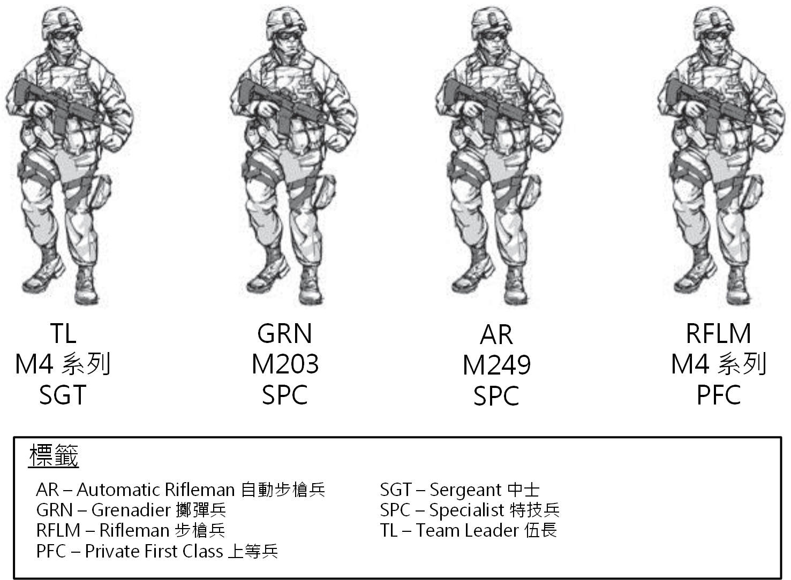
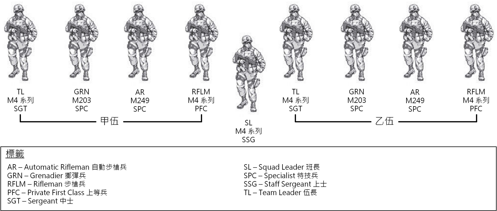

# 第二節 - 步兵排與班的腳色

1-34. 步兵排與班是針對進行進攻性、防禦性與支援穩定或防禦民政部門任務而優化過的單位。 步兵排與班可以部署在世界各地與執行統一地面作戰。

## 組織

1-35. 步兵排與其班可以單獨組織執行任務，也可以根據 METT-TC 組織為一隻聯合部隊。 (請看圖 1-1。) 它可以透過聯合部隊的協同效應 (包含與布雷德利戰車 (Bradley Fighting Vechicle, BFV)、史崔克裝甲運兵車 (Stryker Infantry Carrier Vechicle, ICV)、工程師與其他支援單位整合) 來提高效能。 步兵排與班作為一支聯合部隊，可以利用該隊元素的優勢，同時最大限度地減少局限性。

圖 1-1. 步槍兵排與班

1-36. 步兵單位可以在任何地形與氣候條件下作戰。 他們可能因快速戰術部署而成為主導單位。 在該情況下，他們能夠很早奪取並獲得主導權、攻佔及維持或控制地形、以及以龐大火力阻止敵軍。 步兵單位在城鎮地形特別有效，他們能夠滲透並快速移動到敵人的位置後方。 領導者可以透過直升機或空運來增進他們的機動性。

1-37. 部署步兵單位的考量是基於任務、類型、裝備、能力、限制與單位的組織。 其他能力則是基於一個單位的訓練計劃、領導力、道德、個人強度與其他許多因素。 這些其他能力會根據當下狀況隨時改變。

### 步兵班的伍 (Infantry Squad Fire Team)

1-38. 步兵班的伍 (Fire Team) 被設計為以小隊進行戰鬥，而且是步兵排中的戰鬥單位。 步兵排與班的成功與失敗都是基於他們的伍的行動。

1-39. 步兵班的伍被設計為一個獨立行動的小隊。 (請參考圖 1-2。) 自動步槍兵提供一個內部的火力基點，同時具備對一個區域目標以小型手持火力進行持續壓制的能力。 步槍兵對點目標提供精準、致命的直接火力。 步槍兵可能會被配屬一隻肩射飛彈 (Shoulder-Fired Missile, SLM)。 擲彈兵針對點目標或者區域目標提供高爆火力 (High Explosive, HE)。 伍長以身作則領導他的伍。

圖 1-2. 步兵伍

譯註：中華民國陸軍中並沒有特技兵 (Specialist, SPC) 的軍階存在。 在美國陸軍中，特技兵位於上等兵 (PFC) 之上，下士 (CPL) 之下，並擁有與下士相同的薪資階級 E4。 特技兵是美國陸軍之中，士兵的最高階級，也是最多人擁有的軍階。 上等兵服務滿兩年並且表現優異之後即會晉升為特技兵。 另外，具有四年大學學位的新招募生或軍官候選人也會直接被任命為特技兵。

### 步兵班 (Infantry Squad)

1-40. 現在只有一種步兵班，而且他的主要腳色是調動或者火力基點的單位。 (請參考圖 1-3。) 雖然排的任務編組可能改變，但是步兵班的組織一般來說都維持一致。

1-41. 這個步兵班是所有戰術任務編組的模範。 它包含兩個伍及一個班長。 它能夠建立一個火力基點、提供其他單位的安全或是在其中一支伍接火與移動來提供火力基點的同時，讓另一支伍移動到另一個優勢位置或前往另一個目標。 班長有兩位下屬領導來指揮兩支伍，讓它能專注在掌控整支班。

註：每班持有的肩射飛彈的戰鬥負載為兩支。 可能是兩支 M72 系列輕型反坦克武器、M136 系列反坦克武器、 M141 反碉堡彈藥 (Bunker Defeat Munitions, BDMs) 或是上面各種分配給步槍兵的組合。

圖 1-3. 步兵班

譯註：圖 1-3 中原本的「甲伍」英文為「Alpha Team」，「乙伍」為「Bravo Team」。Alpha、Bravo 為英文軍事行動時常用來代表 A、B 的呼號。 為了要配合台灣的用詞習慣，我將之改為甲乙丙丁的命名形式。
