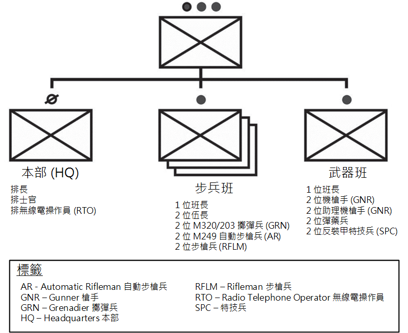

# 第二節 - 步兵排與班的腳色

1-34. 步兵排與班是針對進行進攻性、防禦性與支援穩定或防禦民政部門任務而優化過的單位。 步兵排與班可以部署在世界各地與執行統一地面作戰。

## 組織

1-35. 步兵排與其班可以單獨組織執行任務，也可以根據 METT-TC 組織為一隻聯合部隊。 (請看圖 1-1。) 它可以透過聯合部隊的協同效應 (包含與布雷德利戰車 (Bradley Fighting Vechicle, BFV)、史崔克裝甲運兵車 (Stryker Infantry Carrier Vechicle, ICV)、工程師與其他支援單位整合) 來提高效能。 步兵排與班作為一支聯合部隊，可以利用該隊元素的優勢，同時最大限度地減少局限性。

圖 1-1. 步槍兵排與班

1-36. TODO (p.43)
